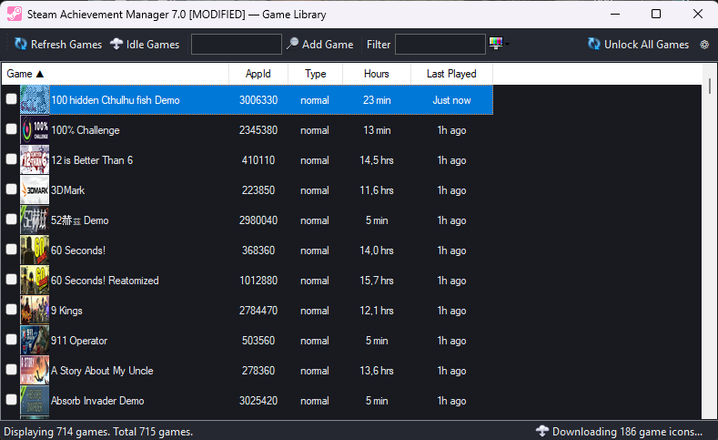

# Steam Achievement Manager 7.0 [MODIFIED]

A heavily modified version of [Steam Achievement Manager](https://github.com/gibbed/SteamAchievementManager) by gibbed. This fork adds a modern dark UI, idle modes, localization, playtime tracking, and many quality-of-life improvements while preserving full compatibility with the original Steam API layer.

---

## Table of Contents

- [Requirements](#requirements)
- [Build](#build)
- [Changes from Original](#changes-from-original)
  - [New Features](#new-features)
  - [UI Overhaul](#ui-overhaul)
  - [Improvements and Fixes](#improvements-and-fixes)
  - [Removed / Unchanged](#removed--unchanged)
- [Feature Details](#feature-details)
  - [Idle Modes](#idle-modes)
  - [Active Games Manager](#active-games-manager)
  - [View Modes](#view-modes)
  - [Playtime Data](#playtime-data)
  - [Localization](#localization)
  - [Achievement Editor](#achievement-editor)
- [Command Line Arguments](#command-line-arguments)
- [Project Structure](#project-structure)
- [Screenshots](#screenshots)
- [Attribution](#attribution)

---

## Requirements

- Windows 7 or later
- .NET Framework 4.8
- Steam client running with an authenticated account
- Platform: x86 (32-bit)

## Build

```
dotnet build SAM.sln -c Release -p:Platform=x86
```

Output: `upload\SAM.Picker.exe`, `upload\SAM.Game.exe`

---

## Changes from Original

### New Features

| Feature | Description |
|---------|-------------|
| **6 Idle Modes** | Simple, Sequential, Round-Robin, Target Hours, Schedule, Anti-Idle -- all managed through a unified dialog |
| **Active Games Manager** | Centralized window to monitor, pause, resume, and stop all running idle processes |
| **Playtime Display** | Hours played and last played date extracted from local Steam files (no API key needed) |
| **Tile / List View Toggle** | Switch between card-style tile view and detailed list view with sortable columns |
| **Batch Game Selection** | Checkboxes in list view to select up to 32 games for batch idle operations |
| **Localization System** | English and Russian UI with runtime language switching |
| **Settings Dialog** | Unified settings popup for language and view mode preferences |
| **Image Caching** | Game icons and covers downloaded once and cached in memory for the session |
| **Graceful Idle Shutdown** | Named EventWaitHandle signals allow clean SteamAPI disconnection instead of process kill |
| **Manifest Cleanup** | Automatic removal of orphaned `appmanifest_*.acf` files created during idle |
| **Batch Unlock via CLI** | `--unlock-all` argument to unlock all achievements without GUI |

### UI Overhaul

The entire application uses a custom dark theme inspired by modern code editors:

| Element | Color |
|---------|-------|
| Background | #181A20 |
| Surface | #1E2028 |
| Toolbar | #252830 |
| Accent | #6C63FF |
| Secondary Accent | #00D9A3 |
| Text | #E8EAED |
| Text Secondary | #9AA0A6 |
| Selection | #2E2B4A |

Applied to both windows (Game Picker and Achievement Editor), including:
- Custom OwnerDraw rendering for ListView items (games and achievements)
- Dark-styled TabControl with accent underline on active tab
- Dark toolbars, status bars, context menus, and dialogs
- Alternating row colors in list views
- Custom checkbox rendering (no native WinForms green highlights)

### Improvements and Fixes

| Area | Change |
|------|--------|
| **Startup Performance** | Deferred image URL resolution -- saves ~3000 native IPC calls on startup |
| **Progress Indicator** | Status bar shows "Checking game ownership... N%" during loading |
| **BeginInvoke Crash** | Added `IsHandleCreated` guard before cross-thread BeginInvoke calls |
| **Exception Handling** | Broad `catch(Exception)` in achievement download prevents silent crashes |
| **Statistics Tab** | Automatically hidden when a game has 0 statistics |
| **Column Sorting** | Clickable column headers with ascending/descending toggle and sort indicator arrows |
| **Achievement Icons** | Reduced from 64x64 to 32x32 for compact, consistent display |
| **ListView Borders** | Removed native 3D borders from all list views |
| **Tab Borders** | Painted over native TabControl borders to match dark theme |
| **Protected Achievements** | Subtle dark red background (#281919) to indicate non-modifiable achievements |
| **Thread Safety** | Thread-safe HashSet for concurrent icon download tracking |
| **Memory** | WebClient proper disposal, Bitmap stream handling improvements |

### Removed / Unchanged

- **SAM.API** -- The entire Steam API layer is untouched. All native interop, vtable calls, and pipe management remain identical to the original.
- **Game detection logic** -- Steam game enumeration, ownership checks, and app data retrieval are unchanged.
- **Achievement read/write** -- The core `SetAchievement`, `GetAchievement`, and `StoreStats` calls are original code.
- **No card farming** -- Card farming was prototyped and removed due to Steam API limitations.

---

## Feature Details

### Idle Modes

Six modes available through the Idle Games button on the toolbar:

| Mode | Description |
|------|-------------|
| **Simple** | Launch all selected games simultaneously. Optional hour limit. |
| **Sequential** | Launch games one at a time, each for a specified number of hours. |
| **Round-Robin** | Rotate between games at a configurable interval (minutes). |
| **Target Hours** | Run games until each reaches a target total playtime. |
| **Schedule** | Run only during specified hours (e.g., 02:00 to 08:00). |
| **Anti-Idle** | Periodic restart of idle processes to prevent Steam timeout. |

When no games are checked, all currently displayed games are used. Maximum 32 games per session (Steam limit).

### Active Games Manager

A dedicated window that opens when idle sessions start:

- Real-time list of all running idle processes
- Per-game controls: Pause / Resume / Stop
- Elapsed time counter for each game
- "Stop All" button with confirmation dialog
- Graceful shutdown: signals processes via named events, falls back to kill after 3-second timeout
- Cleans up orphaned Steam manifest files on close

### View Modes

**List View** (default):
- Columns: Game, AppId, Type, Hours, Last Played
- Sortable by clicking column headers
- Checkboxes for batch selection
- Small 32x32 game icons

**Tile View**:
- Card-style grid with game cover images
- Custom OwnerDraw rendering with hover highlight
- Virtual mode for smooth scrolling with large libraries

Toggle between views through the Settings dialog (gear icon).

### Playtime Data

Hours played and last played date are read from Steam's local file:

```
Steam/userdata/<AccountId>/config/localconfig.vdf
```

No Steam Web API key is required. AccountId is computed as the lower 32 bits of SteamID64.

### Localization

Two languages supported: **English** (default) and **Russian**.

Switch language through the Settings dialog (gear icon on toolbar). The language setting is propagated to the Achievement Editor window via environment variable.

Localized elements:
- All toolbar buttons and tooltips
- Status bar messages
- Dialog boxes and error messages
- Column headers
- Idle mode names and descriptions
- Achievement editor labels

Game names are NOT translated (they come from Steam).

### Achievement Editor

When opening a game, the achievement editor shows:

- Achievement list with custom OwnerDraw (icon, name, description, unlock time)
- Toolbar: Lock All / Invert / Unlock All / Show Locked Only / Show Unlocked Only / Filter
- Custom dark checkboxes (checked = teal filled with white checkmark)
- Protected achievements shown with dark red background and blocked from modification
- Statistics tab (auto-hidden if game has no stats)
- Commit Changes button to save modifications to Steam

---

## Command Line Arguments

### SAM.Picker.exe

Standard launch, no arguments required.

### SAM.Game.exe

```
SAM.Game.exe <AppId>                    -- Open achievement editor for game
SAM.Game.exe <AppId> --idle             -- Idle mode (no GUI, runs indefinitely)
SAM.Game.exe <AppId> --idle --hours=10  -- Idle for 10 hours then exit
SAM.Game.exe <AppId> --unlock-all       -- Unlock all achievements (no GUI)
```

---

## Project Structure

```
SAM.sln
SAM.API/                           -- Steam API library (UNCHANGED)
  Steam/                           -- Steam client connection
  Wrappers/                        -- Interface wrappers (SteamUserStats, SteamApps, etc.)
  Types/                           -- Data types (UserStatsReceived, AchievementInfo, etc.)

SAM.Picker/                        -- Main application
  GamePicker.cs                    -- Main form: game list, filters, sorting, idle launch
  GamePicker.Designer.cs           -- Form layout and control definitions
  GameInfo.cs                      -- Game data model
  MyListView.cs                    -- Custom ListView with double-buffering
  PlaytimeReader.cs                -- [NEW] localconfig.vdf parser for playtime data
  ActiveGamesForm.cs               -- [NEW] Active idle games monitor
  IdleSettingsDialog.cs            -- [NEW] Idle mode configuration dialog
  SettingsDialog.cs                -- [NEW] Language and view settings dialog
  Localization.cs                  -- [NEW] English/Russian localization system
  DarkTheme.cs                     -- [NEW] Dark theme engine with custom renderers

SAM.Game/                          -- Achievement/Statistics editor
  Program.cs                       -- Entry point, headless modes, graceful shutdown
  Manager.cs                       -- Achievement/stats form with OwnerDraw
  Manager.Designer.cs              -- Form layout
  Stats/AchievementInfo.cs         -- Achievement data model
  DarkTheme.cs                     -- [NEW] Dark theme for editor window
  GameLocalization.cs              -- [NEW] Editor localization (reads SAM_LANGUAGE env var)
```

Files marked `[NEW]` were created for this modified version. All other files are modified from the original.

---

## Screenshots

### Main Window -- List View


### Main Window -- Tile View


### Achievement Editor


### Idle Settings


### Active Games Manager


---

## Attribution

Based on [SteamAchievementManager](https://github.com/gibbed/SteamAchievementManager) by gibbed.

Icons from the [Fugue Icons](https://p.yusukekamiyamane.com/) set by Yusuke Kamiyamane.
