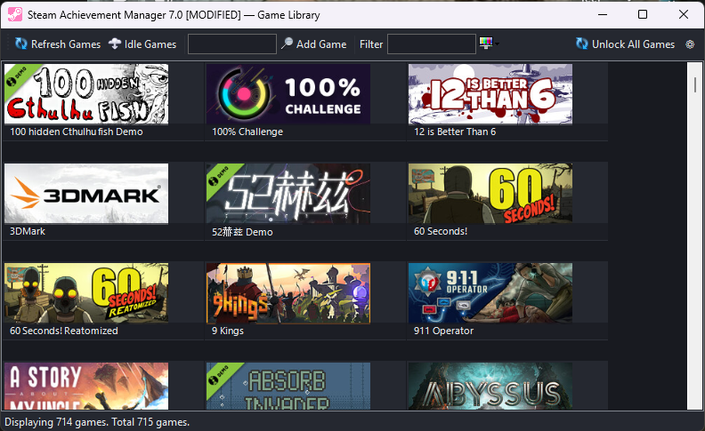
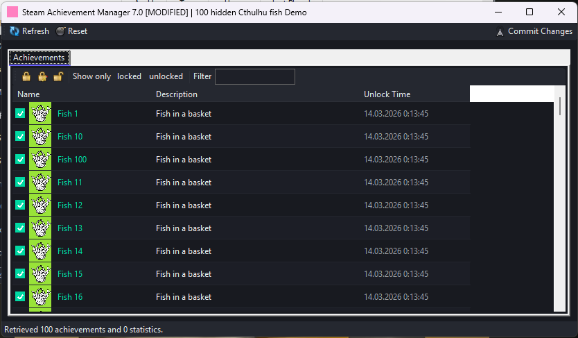
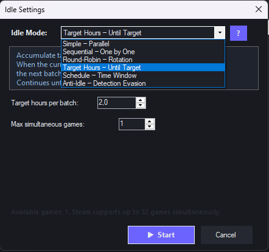
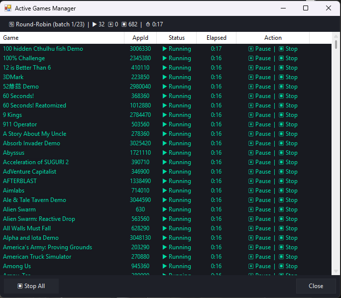

# SAM Evolved (Steam Achievement Manager)

**[EN](README.md)** | **[RU](README.ru.md)**

Глубоко переработанная версия [Steam Achievement Manager](https://github.com/gibbed/SteamAchievementManager) от gibbed. Добавлена интеграция Steam Web API, режимы простоя, защита VAC, панель профиля, параллельная загрузка, локализация и множество улучшений. Полная совместимость с оригинальным Steam API.

[](https://github.com/TrooSlash/SAM-Evolved_Steam_Achievement_Manager/releases/latest)

---

## Содержание

- [Требования](#требования)
- [Сборка](#сборка)
- [Отличия от оригинала](#отличия-от-оригинала)
  - [Новые функции](#новые-функции)
  - [Исправления и улучшения](#исправления-и-улучшения)
  - [Без изменений](#без-изменений)
- [Описание функций](#описание-функций)
  - [Интеграция Steam Web API](#интеграция-steam-web-api)
  - [Панель профиля](#панель-профиля)
  - [Прогресс достижений](#прогресс-достижений)
  - [Защита VAC](#защита-vac)
  - [Трехфазная загрузка](#трехфазная-загрузка)
  - [Режимы Idle](#режимы-idle)
  - [Менеджер активных игр](#менеджер-активных-игр)
  - [Режимы отображения](#режимы-отображения)
  - [Данные о времени игры](#данные-о-времени-игры)
  - [Локализация](#локализация)
  - [Определение защищённых достижений](#определение-защищённых-достижений)
  - [Логирование](#логирование)
  - [Горячие клавиши](#горячие-клавиши)
  - [Редактор достижений](#редактор-достижений)
- [Аргументы командной строки](#аргументы-командной-строки)
- [Структура проекта](#структура-проекта)
- [Скриншоты](#скриншоты)
- [Авторство](#авторство)

---

## Требования

- Windows 7 и выше
- .NET Framework 4.8
- Steam клиент (запущен, пользователь авторизован)
- Платформа: x86 (32-bit)
- Steam Web API ключ (опционально, открывает дополнительные функции)

## Сборка

```
dotnet build SAM.sln -c Release -p:Platform=x86
```

Результат: `upload\SAM.Picker.exe`, `upload\SAM.Game.exe`

---

## Отличия от оригинала

### Новые функции

| Функция | Описание |
|---------|----------|
| **Steam Web API** | Опциональный API ключ для полной библиотеки игр, статистики достижений, профиля и защиты VAC |
| **Панель профиля** | Аватар, ник, статус онлайн, страна, уровень Steam, прогресс опыта, количество значков |
| **Прогресс достижений** | Счетчик открытых/всего достижений по каждой игре в списке (требуется API ключ) |
| **Глобальный % достижений** | Каждое достижение показывает процент игроков, которые его получили |
| **Защита VAC** | Автоматическое определение VAC-защищенных игр с предупреждением перед изменением |
| **Трехфазная загрузка** | Локальные игры показываются мгновенно, типы и API-данные загружаются в фоне |
| **6 режимов Idle** | Simple, Sequential, Round-Robin, Target Hours, Schedule, Anti-Idle |
| **Менеджер активных игр** | Окно мониторинга с паузой, возобновлением и остановкой каждой игры |
| **Время в игре** | Наигранные часы и дата последнего запуска из локальных файлов Steam (без API ключа) |
| **Плитка / Список** | Переключение между карточками и таблицей с сортируемыми столбцами |
| **Пакетный выбор** | Чекбоксы в режиме списка для выбора до 32 игр |
| **Локализация** | Английский и русский интерфейс с переключением в реальном времени |
| **Параллельная загрузка** | До 6 одновременных загрузок логотипов и 8 одновременных API-запросов достижений |
| **Кэширование изображений** | Иконки игр кэшируются в памяти и сохраняются при обновлении списка |
| **Корректное завершение Idle** | Сигнал через EventWaitHandle для чистого отключения от SteamAPI |
| **Очистка манифестов** | Автоматическое удаление пустых файлов `appmanifest_*.acf` после idle |
| **Пакетная разблокировка** | Аргумент `--unlock-all` для разблокировки всех достижений без GUI |
| **Определение защиты** | Автоматическое фоновое сканирование schema-файлов Steam; замок в списке, визуальные маркеры в редакторе, фильтр «Скрыть защищённые» |
| **Логирование** | Serilog: файлы в `lib/logs/`, ежедневная ротация, настраиваемый уровень лога, кнопка «Открыть логи» в настройках |
| **Шифрование API-ключа** | Ключ шифруется через Windows DPAPI (префикс `ENC:` в файле настроек) |
| **Горячие клавиши** | F5/Ctrl+R (обновить), Ctrl+F (поиск), Ctrl+S (настройки/сохранить) |

### Исправления и улучшения

| Область | Изменение |
|---------|-----------|
| **Запуск** | Трехфазная параллельная загрузка: локальное сканирование, типы из XML, обогащение через API |
| **Загрузка логотипов** | 6 одновременных Task.Run вместо одного BackgroundWorker |
| **Загрузка достижений** | 8 одновременных API-запросов через SemaphoreSlim с инкрементальным обновлением UI |
| **Кэш изображений** | Логотипы сохраняются при обновлении списка -- без повторной загрузки в рамках сессии |
| **Индикатор прогресса** | Строка состояния показывает фазу загрузки и счетчики прогресса |
| **Безопасность BeginInvoke** | Проверка `IsHandleCreated` перед всеми межпоточными вызовами |
| **Обработка ошибок** | `catch(Exception)` предотвращает тихие падения при загрузке |
| **Вкладка статистик** | Автоматически скрывается если у игры 0 статистик |
| **Сортировка столбцов** | Клик по заголовку переключает направление, стрелка-индикатор |
| **Иконки достижений** | Уменьшены с 64x64 до 32x32 для компактного отображения |
| **Защищенные достижения** | Визуальное выделение неизменяемых достижений |
| **Потокобезопасность** | Thread-safe коллекции для параллельной загрузки |
| **Память** | Корректное освобождение WebClient и Bitmap |
| **HTTP таймауты** | 10-секундный таймаут на все WebClient-запросы (был бесконечный) |
| **Безопасность pipe** | Хэндл Steam pipe освобождается при частичной ошибке Client.Initialize() |
| **Нативная память** | AllocHGlobal/FreeHGlobal обёрнуты в try-finally |
| **Дизайн-система** | Все цвета централизованы в общем DarkPalette; семантические токены вместо захардкоженных значений |
| **Архитектура** | Загрузка логотипов выделена в сервис; AssemblyResolve обработчик вынесен в Bootstrap |
| **Юнит-тесты** | 56 NUnit-тестов: формула XP, окно расписания, форматирование времени, VDF-парсер, флаги прав |

### Без изменений

- **SAM.API** -- Весь слой Steam API interop не тронут. Нативные vtable-вызовы и управление pipe идентичны оригиналу.
- **Обнаружение игр** -- Перечисление, проверка владения и получение данных игр -- оригинальный код.
- **Чтение/запись достижений** -- Вызовы `SetAchievement`, `GetAchievement` и `StoreStats` без изменений.

---

## Описание функций

### Интеграция Steam Web API

Опциональный Steam Web API ключ открывает дополнительные возможности. Ключ настраивается в параметрах (иконка шестеренки) и хранится локально в `sam_settings.ini`.

Что дает API ключ:
- Полная библиотека игр (находит удаленные и бесплатные игры)
- Колонка прогресса достижений в списке игр
- Панель профиля с аватаром, уровнем и значками
- Предупреждения VAC в редакторе достижений
- Глобальный процент разблокировки достижений

Как получить ключ:
1. Откройте [steamcommunity.com/dev/apikey](https://steamcommunity.com/dev/apikey)
2. Введите любое доменное имя (например, `localhost`)
3. Скопируйте полученный ключ в настройки программы

Ключ бесплатный, не требует одобрения и хранится локально до переустановки приложения.

### Панель профиля

При наличии API ключа в верхней части главного окна появляется панель профиля:

- Аватар (64x64)
- Ник с цветным индикатором статуса онлайн
- Код страны
- Уровень Steam в акцентном бейдже
- Прогресс-бар опыта (текущий / необходимый для следующего уровня)
- Общее количество значков

Данные профиля загружаются асинхронно при запуске.

### Прогресс достижений

При наличии API ключа в списке игр появляется колонка "Достижения" с соотношением открытых к общему количеству (например, `12/50`). Достижения загружаются параллельно (8 одновременных запросов) с инкрементальным обновлением интерфейса. Игры без достижений показывают прочерк. Колонка автоматически скрывается при отсутствии API ключа.

### Защита VAC

Редактор достижений автоматически проверяет, использует ли игра VAC (Valve Anti-Cheat) или сторонние античит-системы (EAC, BattlEye). При обнаружении:

- В верхней части редактора отображается панель предупреждения
- Изменение достижений блокируется по умолчанию
- Кнопка переопределения позволяет продолжить на свой риск с явным подтверждением
- Кнопка "Разблокировать все" показывает отдельное предупреждение о VAC

Эта защита не требует API ключа -- используются данные категорий из страницы игры в магазине Steam.

### Трехфазная загрузка

Загрузка игр разделена на три фазы для ускорения запуска:

| Фаза | Источник | Скорость | Назначение |
|------|----------|----------|------------|
| 1 | Локальные файлы Steam | Мгновенно | Сканирование appmanifest, реестра, localconfig.vdf. Игры появляются сразу. |
| 2 | Удаленный XML | Сеть | Загрузка базы типов игр. Обновление типов (normal/demo/mod/junk). |
| 3 | Steam Web API | Сеть | Получение дополнительных игр, не найденных локально. Требуется API ключ. |

Данные о времени игры применяются после фазы 1. Загрузка логотипов начинается после фазы 1. Загрузка достижений начинается после завершения фазы 3.

### Режимы Idle

Шесть режимов через кнопку Idle Games на панели инструментов:

| Режим | Описание |
|-------|----------|
| **Simple** | Запуск всех выбранных игр одновременно. Опциональный лимит часов. |
| **Sequential** | Запуск игр по одной, каждая на заданное количество часов. |
| **Round-Robin** | Ротация между играми с настраиваемым интервалом (минуты). |
| **Target Hours** | Работа пока каждая игра не достигнет целевого времени. |
| **Schedule** | Работа только в заданные часы (например, 02:00 -- 08:00). |
| **Anti-Idle** | Периодический перезапуск процессов для предотвращения таймаута Steam. |

Если ни одна игра не отмечена -- используются все отображаемые игры. Максимум 32 игры за сессию (ограничение Steam). Счетчик внизу показывает количество выбранных игр (например, `5/32`).

### Менеджер активных игр

Отдельное окно при запуске idle-сессий:

- Список всех запущенных idle-процессов в реальном времени
- Управление каждой игрой: Пауза / Возобновление / Стоп
- Счетчик времени для каждой игры
- Кнопка "Остановить все" с подтверждением
- Корректное завершение через именованные события, с откатом к kill через 3 секунды
- Очистка осиротевших манифестов Steam при закрытии

### Режимы отображения

**Список** (по умолчанию):
- Столбцы: Игра, AppId, Тип, Часы, Последний запуск, Достижения (с API ключом)
- Сортировка по клику на заголовок столбца (переключение направления)
- Чекбоксы для пакетного выбора (до 32 игр)
- Маленькие иконки 36x36 с чередованием фона строк

**Плитка**:
- Карточки с обложками игр (184x69)
- Кастомная отрисовка OwnerDraw с подсветкой при наведении
- Виртуальный режим для плавной прокрутки больших библиотек

Переключение через диалог настроек.

### Данные о времени игры

Наигранные часы и дата последнего запуска считываются из локального файла Steam:

```
Steam/userdata/<AccountId>/config/localconfig.vdf
```

Steam Web API ключ не требуется. AccountId вычисляется как младшие 32 бита SteamID64.

### Локализация

Два языка: **английский** (по умолчанию) и **русский**.

Переключение через диалог настроек (шестеренка на панели инструментов). Язык передается в окно редактора достижений через переменную окружения `SAM_LANGUAGE`.

Локализовано:
- Все кнопки и подсказки панели инструментов
- Сообщения строки состояния и индикаторы прогресса
- Диалоговые окна и сообщения об ошибках
- Заголовки столбцов
- Названия и описания режимов idle
- Подписи редактора достижений
- Предупреждения VAC
- Инструкции по API ключу

Названия игр не переводятся (берутся из Steam).

### Определение защищённых достижений

SAM автоматически сканирует локальные schema-файлы Steam (`appcache/stats/UserGameStatsSchema_*.bin`) в фоне для определения игр с серверно-валидируемыми достижениями.

- Игры с защищёнными достижениями показывают замок в списке (например, `12/50`)
- В редакторе защищённые достижения имеют замок на иконке, золотой текст и тултип
- В заголовке окна показан счётчик: `Game Name | 3 защищённых`
- Кнопка-фильтр «Скрыть защищённые» в панели инструментов
- Предупреждение когда все достижения в игре защищены
- Результаты кэшируются в `lib/protected_cache.txt` (7 дней, кросс-процессная безопасность)

### Логирование

Файловая диагностика через Serilog. Все ошибки и ключевые действия записываются автоматически.

- Файлы логов: `lib/logs/sam-picker-{date}.log`, `lib/logs/sam-game-{appId}-{date}.log`
- Уровень лога настраивается в параметрах: Debug / Information / Warning / Error
- Изменения применяются мгновенно без перезапуска
- Кнопка «Открыть логи» в настройках для быстрого доступа
- Автоочистка: ежедневная ротация, лимит 10 МБ, хранение 7 файлов
- Защита от крашей: необработанные исключения логируются перед завершением

### Горячие клавиши

| Клавиша | SAM.Picker | SAM.Game |
|---------|------------|----------|
| **F5** / **Ctrl+R** | Обновить список игр | Обновить достижения |
| **Ctrl+F** | Фокус на поиске | — |
| **Ctrl+S** | Открыть настройки | Сохранить изменения |

### Редактор достижений

При открытии игры отображается:

**Вкладка достижений:**
- Список достижений с кастомной отрисовкой (иконка, название, описание, время разблокировки)
- Глобальный процент разблокировки каждого достижения (загружается из Steam API, ключ не нужен)
- Панель: Заблокировать все / Инвертировать / Разблокировать все / Показать заблокированные / Показать разблокированные / Фильтр
- Кастомные чекбоксы (отмечен = бирюзовая заливка с белой галочкой)
- Защищенные достижения выделены и заблокированы для изменения
- Панель предупреждения VAC с возможностью переопределения (при обнаружении античита)

**Вкладка статистик:**
- Статистики игры с редактируемыми значениями
- Автоматически скрывается если у игры нет статистик

Кнопка **Сохранить изменения** для отправки модификаций в Steam.

---

## Аргументы командной строки

### SAM.Picker.exe

Стандартный запуск, аргументы не требуются.

### SAM.Game.exe

```
SAM.Game.exe <AppId>                    -- Открыть редактор достижений
SAM.Game.exe <AppId> --idle             -- Режим простоя (без GUI, бесконечно)
SAM.Game.exe <AppId> --idle --hours=10  -- Простой 10 часов
SAM.Game.exe <AppId> --unlock-all       -- Разблокировать все достижения (без GUI)
```

---

## Структура проекта

```
SAM.sln
SAM.API/                           -- Библиотека Steam API
  Steam/                           -- Подключение к Steam и управление pipe
  Wrappers/                        -- Обёртки интерфейсов (SteamUserStats, SteamApps и др.)
  Types/                           -- Типы данных (UserStatsReceived, AchievementInfo и др.)
  Bootstrap.cs                     -- Общий обработчик AssemblyResolve для lib/ DLL
  Logging/ApiLogger.cs             -- Абстракция логирования (без Serilog)

SAM.Picker/                        -- Главное приложение (браузер библиотеки игр)
  GamePicker.cs                    -- Основная форма: список игр, фильтры, сортировка, параллельная загрузка
  GamePicker.Designer.cs           -- Компоновка формы и определения элементов управления
  GameInfo.cs                      -- Модель данных игры (id, тип, время, достижения)
  MyListView.cs                    -- ListView с двойной буферизацией
  ProfilePanel.cs                  -- Панель профиля Steam
  PlaytimeReader.cs                -- Парсер localconfig.vdf для данных о времени
  SteamWebApi.cs                   -- Клиент Steam Web API (достижения, профиль, значки)
  AppSettings.cs                   -- Хранение настроек (API ключ, шифрование)
  ActiveGamesForm.cs               -- Менеджер активных idle-игр
  IdleSettingsDialog.cs            -- Настройка режимов idle
  SettingsDialog.cs                -- Настройки языка, отображения, API ключа и уровня лога
  Localization.cs                  -- Локализация EN/RU
  DarkTheme.cs                     -- Тема с кастомными рендерами
  DarkPalette.cs                   -- Общая палитра цветов (compile-linked в SAM.Game)
  LogSetup.cs                      -- Инициализация Serilog и переключение уровня лога
  LogoDownloadService.cs           -- Событийный сервис параллельной загрузки логотипов

SAM.Game/                          -- Редактор достижений и статистик
  Program.cs                       -- Точка входа, headless-режимы, корректное завершение
  Manager.cs                       -- Форма достижений/статистик, определение VAC, глобальный %
  Manager.Designer.cs              -- Компоновка формы
  Stats/AchievementInfo.cs         -- Модель данных достижений
  DarkTheme.cs                     -- Тема для редактора (делегирует в DarkPalette)
  GameLocalization.cs              -- Локализация редактора (SAM_LANGUAGE)
  LogSetup.cs                      -- Инициализация Serilog для SAM.Game

SAM.Tests/                         -- Юнит-тесты (NUnit)
  PlaytimeFormattingTests.cs       -- FormatPlaytime, FormatLastPlayed
  XpProgressTests.cs               -- Формула прогресса XP
  ScheduleWindowTests.cs           -- Окно расписания idle
  VdfParserTests.cs                -- Парсер localconfig.vdf
  PermissionFlagsTests.cs          -- Битовая маска StatFlags
```

---

## Скриншоты

### Главное окно -- Без API ключа


### Главное окно -- С API ключом


### Главное окно -- Плитка


### Редактор достижений


### Предупреждение VAC


### Настройки Idle


### Менеджер активных игр


### Настройки


---

## Авторство

Основан на [SteamAchievementManager](https://github.com/gibbed/SteamAchievementManager) от gibbed.

Иконки из набора [Fugue Icons](https://p.yusukekamiyamane.com/) от Yusuke Kamiyamane.
